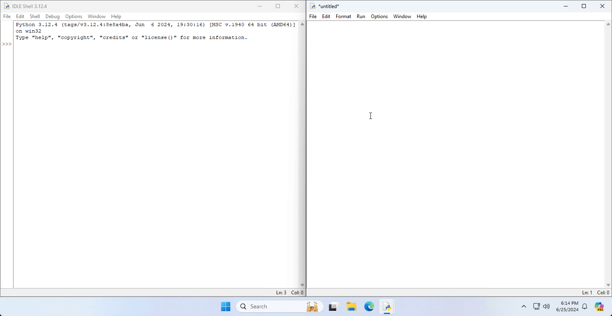
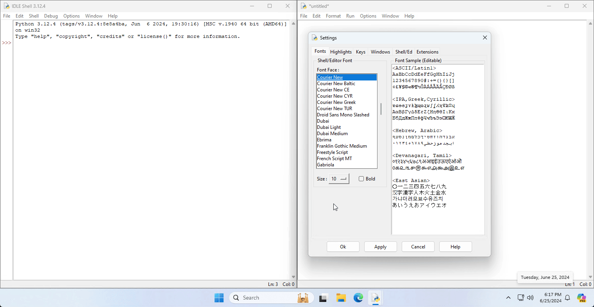
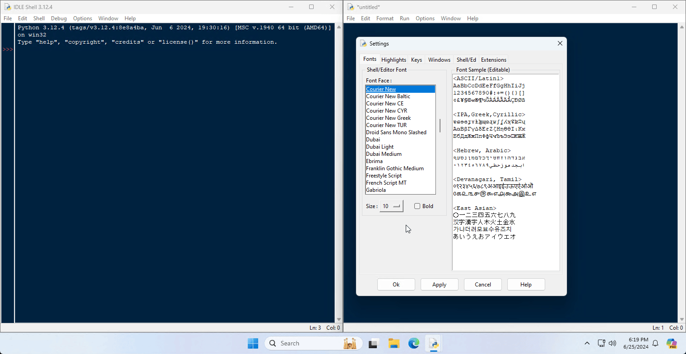

#  Changing the appearance of IDLE
You may wish to change the look and feel of IDLE, so that you feel more comfortable working with it.

Open the IDLE settings, by pressing **Options > Configure IDLE**.

## Changing to a dark theme
To switch IDLE to a dark theme, open the **Highlights** tab of the IDLE settings window.

Under **Highlighting Theme**, change **IDLE Classic** to **IDLE Dark**, and hit apply to save the changes.

## Increasing the font size
For easier reading, you may wish to increase IDLE's font size.

To increase the font size, open the **Fonts** tab of the IDLE settings window.

Under **Shell/Editor Font**, change **Size** to your desired font size, and hit apply to save the changes.
