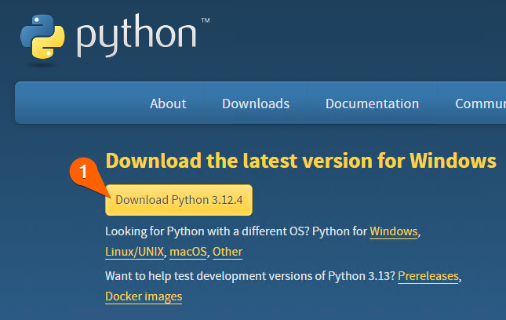
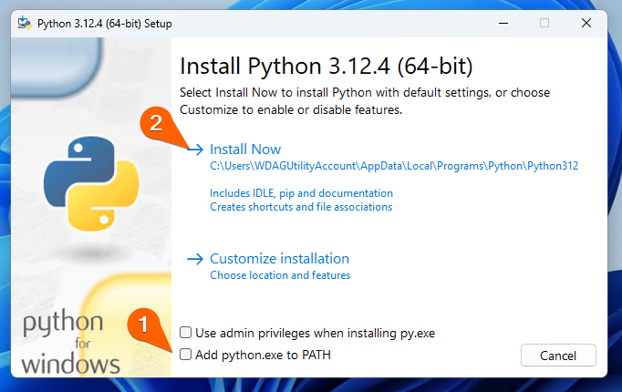
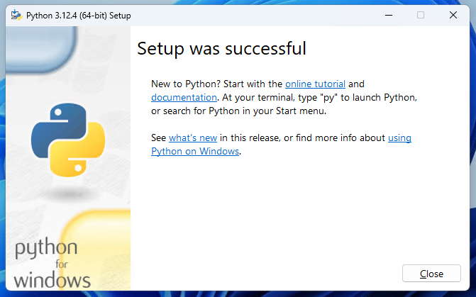

---
sidebar_position: 2
--- 

# Installing Python
Firstly, you will want to install the latest version of Python from the official Python website.

You can download Python by clicking [here](https://www.python.org/downloads/), and pressing the button to download the latest version of the programming language.

Run the downloaded executable file.

:::warning
Make sure that you check the 'Add python.exe to PATH' box!
:::

If you see this window, you sucessfully installed Python. You are now ready to begin your programming journey!
