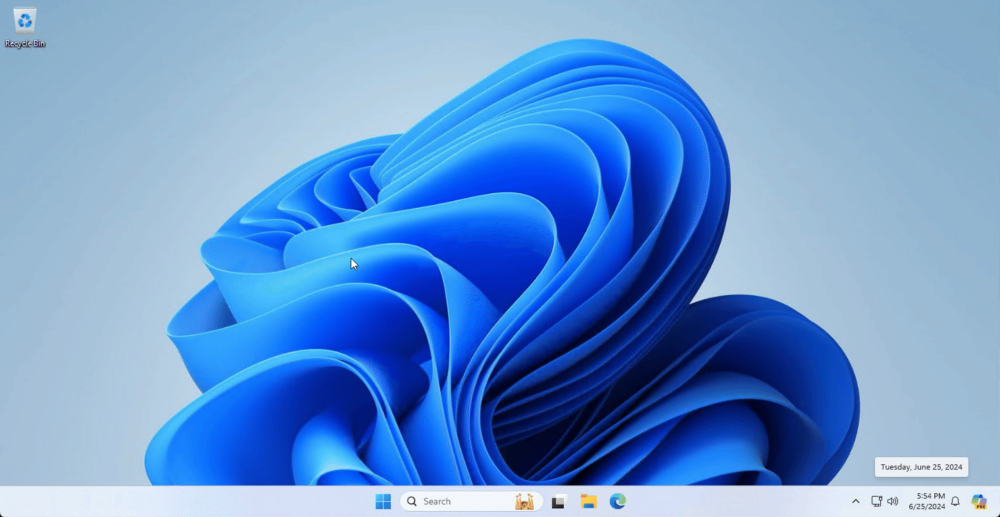
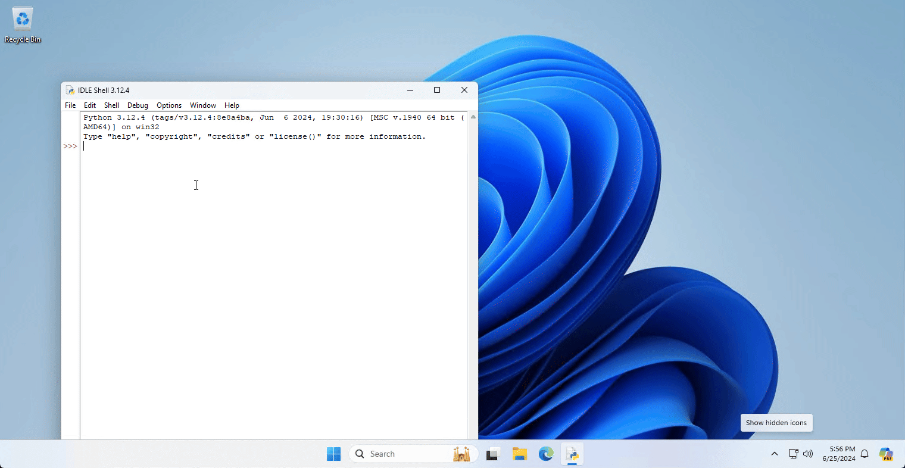
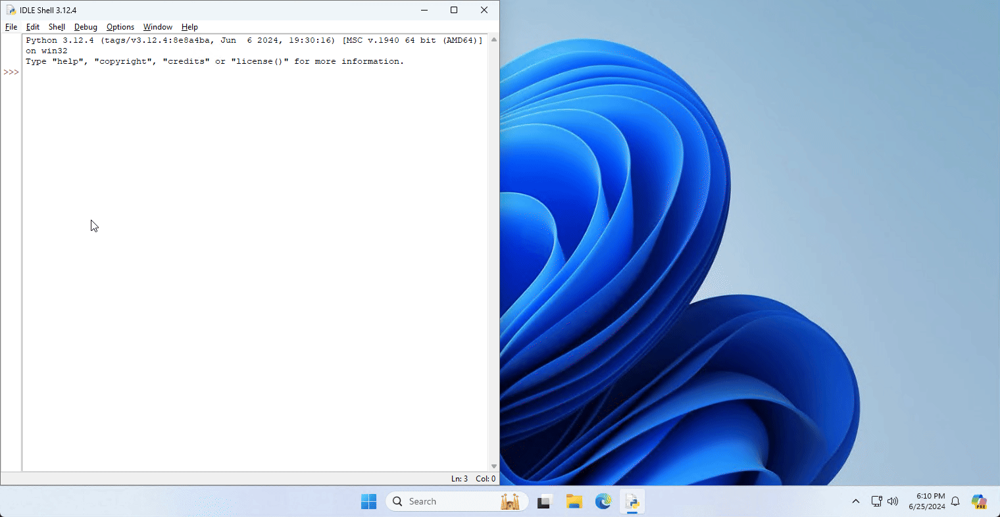
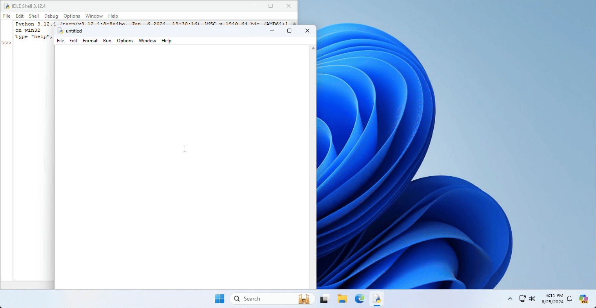

# Opening a Python Script
We will be using IDLE to edit our Python scripts. IDLE (Integrated Development and Learning Environment) is the built in code editor for Python.

To begin writing a script, open the Python IDLE program.

The Python IDLE Shell should appear on your screen.

:::tip
For easier working, snap this window to the **left** of your screen.

:::

You now need to create a new Python script.

To do this, press **File > New File**.

:::tip
For easier working, snap this window to the **right** of your screen.

:::

You are now ready to begin learning Python!